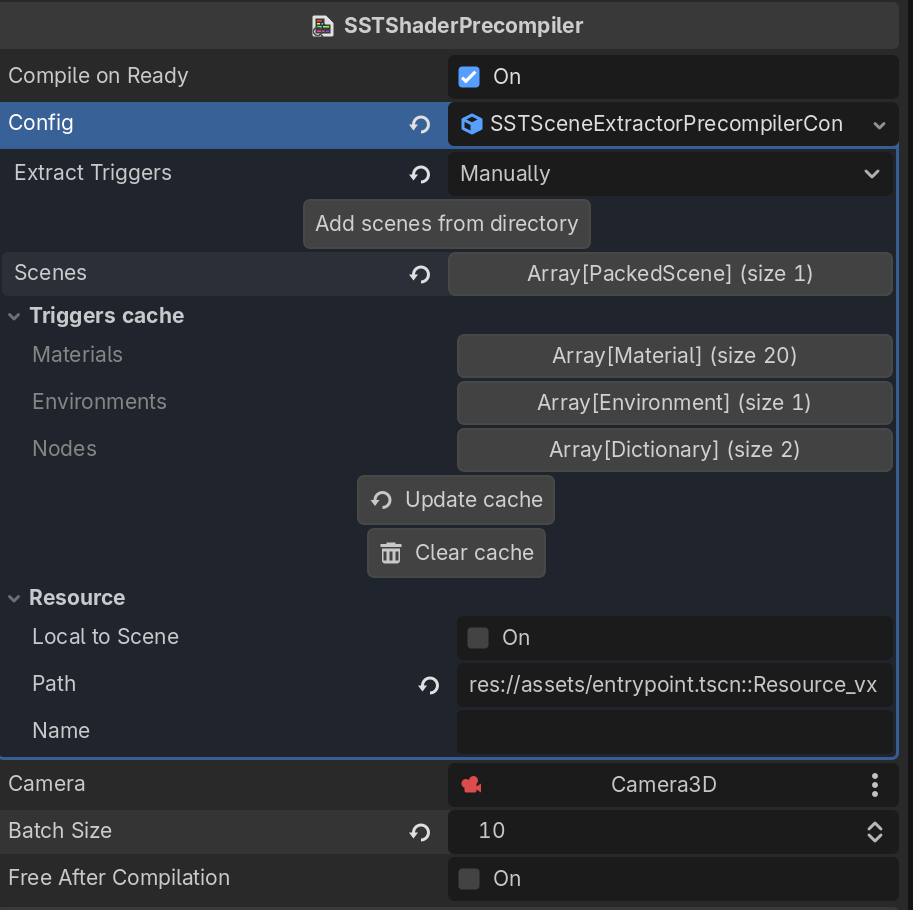
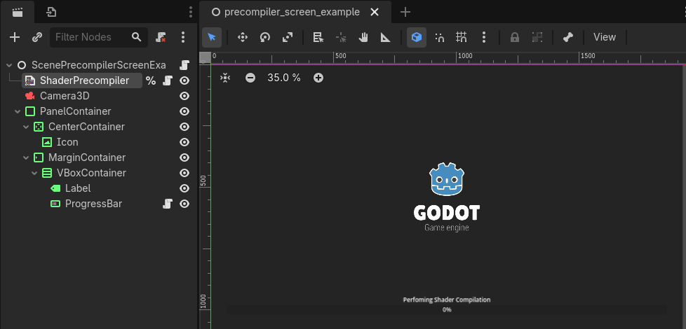
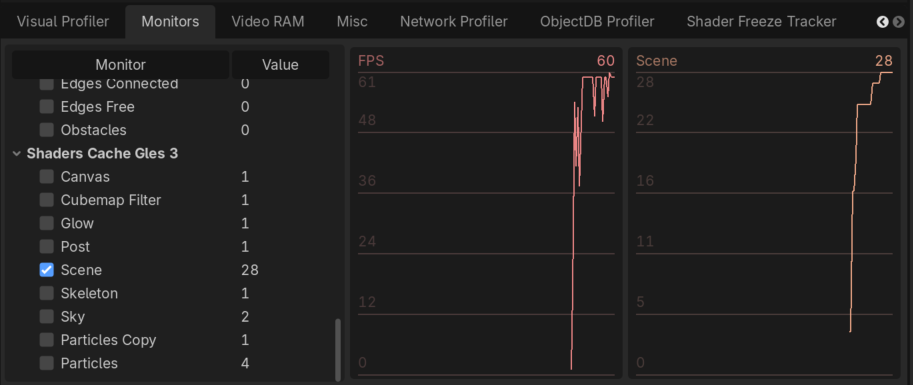
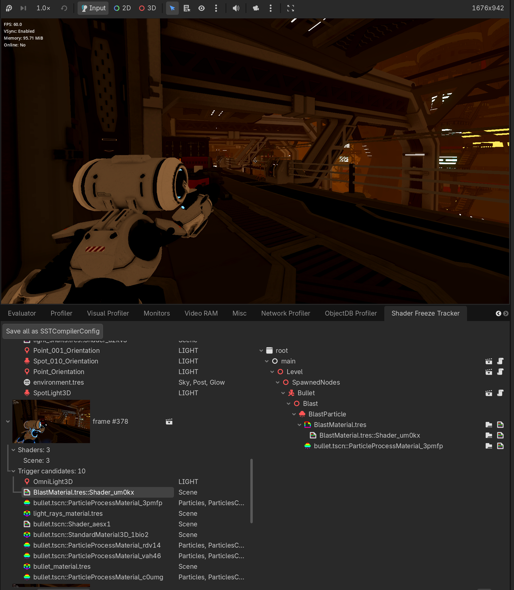
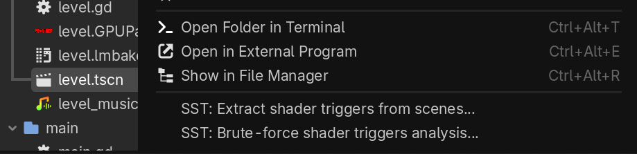

# Shader Stutter Tracker

A Godot 4.6+ addon to debug and fix shader compilation stutters in Compatibility pipeline.

## Usage

Example based on [Third Person Shooter Demo](https://github.com/godotengine/tps-demo)

### Without precompilation
https://github.com/user-attachments/assets/edb6362d-8b65-477c-90a7-7c9e330794f5

### With precompilation by plugin and example preload scene
https://github.com/user-attachments/assets/2f246d89-a1f4-46d4-bca1-596d1a696758

### Shader precompilation

Create a `SSTShaderPrecompiler` node and assign it config with materials, environments and nodes description to compile.
There are two variants of config:
1. `SSTSceneExtractorPrecompilerConfig` accepts list of scenes and extracts compilation triggers from them and their dependencies. Best choice for start. 
2. `SSTPrecompilerConfig` maybe produced by debug tools or filled by hand.

Example of scene with precompilation `addons/shader_stutter_tracker/examples/precompiler_screen_example.tscn`, you can just do inherieted scene for start.

#### Limitations

1. Maybe not all node types covered. Comperhensive analysis compilation triggers is complex and difficult task. For instructions on identifying the problematic node, please refer to the Debugging section. If you are successful in identifying the new compilation trigger, be sure to create an issue.
2. Dynamically changed or created triggers and `load`/`preload` scenes can't be covered by `SSTSceneExtractorPrecompilerConfig`. Add this scenes manually.

### Debugging

#### Monitors

Add new monitors with GLSL compiled shaders counters.

#### New debug tab

In new debug tab you can see all compilation trigger events and known compilation triggers detected by plugin.

1. Enable `shader_stutter_tracker/shader_watcher/enable` (by default enabled for debug).
2. Enable `shader_stutter_tracker/shader_watcher/clear_cache_on_run` to clear godot shader cache before each run (by default enabled for debug).
3. Play your scene, open the **Shader Freeze Tracker** debugger tab.
4. Settings for reports: `shader_stutter_tracker/report/scan_triggers`, `take_screenshots`, `save_scenes`.

#### Brute-force analysis

It will run the scene and iterate through the nodes, looking for trigger nodes that will be displayed in the debugging tab.

## Settings

All settings are under the `shader_stutter_tracker/` prefix in Editor Settings.

| Group | Setting | Default | Default.debug | Description |
|-------|---------|---------|---------------|-------------|
| base | `preserve_settings_when_disabled` | false | false | Keep settings after disabling plugin |
| shader_watcher | `enable` | false | true | Enable runtime shader cache watcher |
| shader_watcher | `clear_cache_on_run` | false | true | Clear shader cache before each run |
| report | `scan_triggers` | false | true | Collect trigger candidates on stutter |
| report | `take_screenshots` | false | true | Capture viewport screenshot per frame |
| report | `save_scenes` | false | true | Save debug scene with visible nodes |
| report | `preserve_last_logs` | 3 | 3 | Number of log directories to keep in `user://shader_stutter_tracker/logs` (scenes) |

## Acknowledgements

Standing on the shoulders of giants:
- https://github.com/Brandt-J/ShaderPrecompiler
- https://www.reddit.com/r/godot/comments/osx0f6/my_very_comprehensive_shader_cache_solution/

## License

This project is licensed under the MIT License. See the [LICENSE](LICENSE) file for details.
